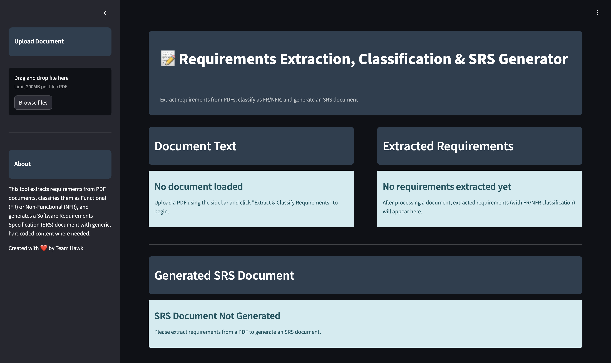
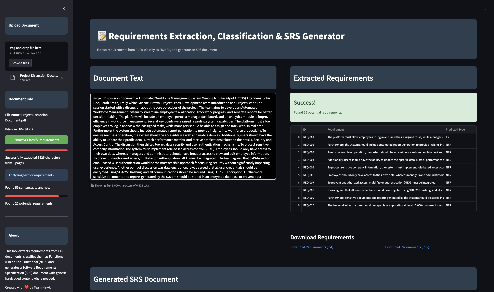

# 🚀 Req-Xtract

Req-Xtract is an 🤖 AI-powered tool designed to automate the extraction and classification of software requirements from Meeting Minutes (MoM) PDFs. It significantly accelerates the 📜 Software Requirements Specification (SRS) creation process using a fine-tuned DistilBERT model and Groq for refinement.

## ✨ Features

- 📄 Extracts **Introduction, Scope, and Architecture** sections from MoM PDFs.
- 🏷️ Classifies requirements into **Functional Requirements (FR)** and **Non-Functional Requirements (NFR)** using a fine-tuned DistilBERT model.
- 📚 Processes multiple PDF files to generate a **single IEEE-standard SRS document**.
- 🔍 Enhances FR/NFR refinement using **Groq**.
- 🎨 Utilizes **Streamlit** for an interactive and user-friendly interface.
- 📊 Includes a **comparative study** showcasing the efficiency of AI-assisted SRS creation versus traditional methods.

## ⚙️ Installation

```sh
# Clone the repository
git clone https://github.com/Vdntrai/Req-xtract.git
cd Req-xtract

# Install dependencies
pip install -r requirements.txt
```

## 🚀 Usage

```sh
streamlit run app.py
```

- 📂 Upload multiple MoM PDF files.
- 🔎 The tool extracts relevant sections and classifies requirements.
- 📑 The final IEEE-standard SRS document is generated in seconds.

## 📊 Comparative Study

| 🛠️ Method | ⏳ Time Required |
|-----------|----------------|
| 📝 Traditional SRS Creation | 1-2 weeks |
| ⚡ AI-Assisted Req-Xtract | A few seconds |

## 🛠️ Technologies Used

- 🐍 Python
- 🏷️ DistilBERT (Fine-tuned for requirement classification)
- 🎨 Streamlit (For UI and workflow)


---

⚡ Accelerate your SRS documentation with Req-Xtract! 🎯
